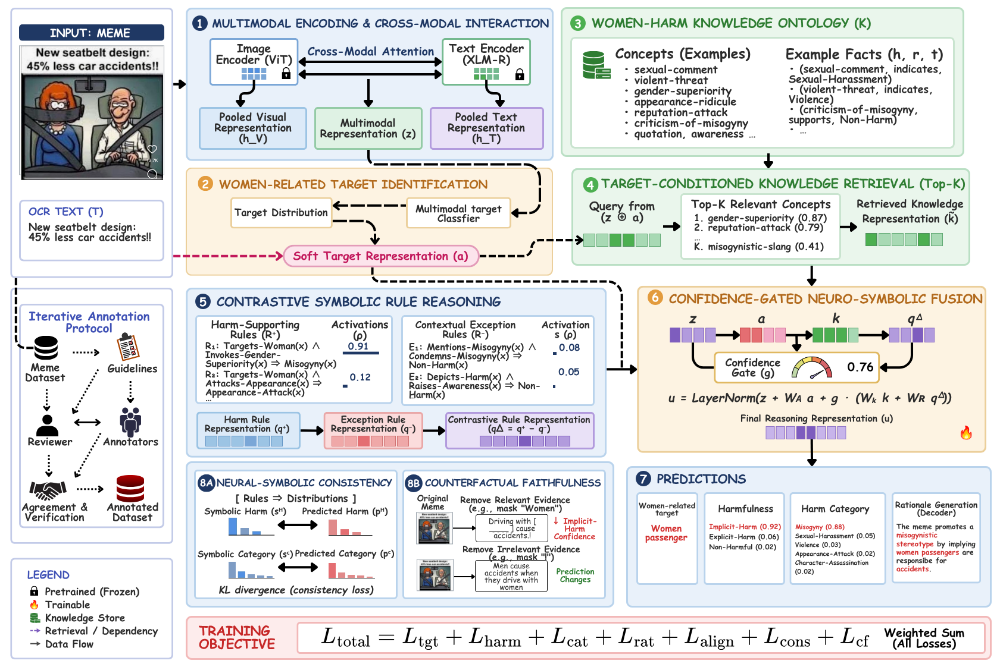

# SheHarm-CAR

Target-conditioned neuro-symbolic framework for **women-targeted harmful meme understanding**,
and **SheHarm-Meme**, the four-task dataset it is trained on.



The four tasks, jointly predicted from a meme image and its OCR text:

| Task | Output | Metric |
|---|---|---|
| Women-related target identification | one of 126 ontology-linked target concepts | macro-F1 (Tgt.-F1) |
| Harmfulness classification | Explicit-Harm / Implicit-Harm / Non-Harm | macro-F1 (Harm-F1) |
| Harm-category classification | 5 categories, harmful instances only | macro-F1 (Cat.-F1) |
| Rationale generation | evidence-grounded explanation | BERTScore |

Plus **Joint-F1** over the (target, harmfulness, category) tuple and **CF-Faith.**, which
combines the confidence drop when target-relevant evidence is removed with prediction
stability when irrelevant evidence is perturbed.

---

## Pipeline

Numbers match the blocks in the diagram above.

1. **Multimodal encoding** — CLIP ViT-B/32 and RoBERTa-base, bidirectional cross-modal
   attention, pooled into `z`.
2. **Target identification** — `p^t = softmax(W_t z + b_t)` over the controlled inventory;
   the soft target `t̃ = Σ p^t_m e^t_m` conditions everything downstream.
3. **Women-Harm Knowledge Ontology** — 611 concepts, 14 relation types, 1,287 triples.
4. **Target-conditioned retrieval** — top-K=5 concepts by cosine similarity, τ=0.07.
5. **Contrastive symbolic reasoning** — 36 soft rules; `ρ_j = Π_l p_jl`,
   `q^Δ = Σ_{R+} ρ e_r − Σ_{R−} ρ e_r`.
6. **Confidence-gated fusion** — `u = LayerNorm(z + W_T t̃ + γ(W_K k̃ + W_R q^Δ))`.
7. **Predictions** — target, harmfulness, harm category, rationale (beam search, beam 4).
8. **Faithfulness objectives** — neural-symbolic consistency `KL(s ‖ p)` and counterfactual
   necessity + invariance.

`L_total = L_tgt + λ_harm L_harm + λ_cat L_cat + λ_rat L_rat + λ_align L_align + λ_cons L_cons + λ_cf L_cf`

---

## Quick start

```bash
pip install -r requirements.txt

# 1. knowledge layer (seconds) — must match the paper's inventory
python knowledge/build_ontology.py --strict

# 2. deterministic battery (~1 min) — run this before spending any GPU hour
python scripts/check_pipeline.py

# 3. dataset
python meme_annotator.py --output dataset/annotations_v2.csv          # labels   (GPU)
python scripts/ocr_and_span.py --annotations dataset/annotations_v2.csv  # OCR    (GPU)
python scripts/build_target_inventory.py                               # 126-concept mapping
python scripts/build_dataset.py                                        # final CSV + Table 3

# 4. train
python experiments/train_sheharm.py --config configs/default.yaml
```

Every experiment script is **independently runnable** and writes `results/<name>.json` plus a
ready-to-paste `results/<name>.tex`.

---

## Reproducing each table

Table numbers are the paper's own, as compiled in `SheHarm-CAR.pdf`.

| Table | Caption | Command |
|---|---|---|
| 1 | Representative ontology concepts and relations | `python knowledge/build_ontology.py` |
| 2 | Representative symbolic rules | `python knowledge/build_ontology.py` |
| 3 | Split and harmfulness distribution | `python scripts/build_dataset.py` |
| 4 | Inter-annotator agreement | `python experiments/table4_agreement.py --a A.csv --b B.csv` |
| 5 | Hyperparameter settings | `python experiments/table5_hyperparams.py` |
| **6** | **Comparison on SheHarm-Meme (main results)** | `python experiments/table6_main_results.py` |
| **7** | **Ablation results** | `python experiments/table7_ablation.py` |
| 8 | Class-wise harmfulness performance | `python experiments/table8_classwise.py` |
| 9 | Counterfactual evidence analysis | `python experiments/table9_counterfactual.py --checkpoint ...` |
| 10 | Robustness under lexical counterfactuals | `python experiments/table10_lexical_robustness.py --checkpoint ...` |
| 11 | Cross-dataset evaluation | `python experiments/table11_cross_dataset.py --dataset harmeme` |
| 12 | Human evaluation of rationales | `python experiments/table12_human_eval.py export --rationales ...` |
| 13 | Representative ontology triples | `python knowledge/build_ontology.py` |
| 14 | Ontology statistics | `python knowledge/build_ontology.py` |
| 15 | Qualitative error analysis | `python experiments/table15_error_analysis.py --checkpoint ...` |

Add `--smoke` to any training script for a 2-epoch shakedown, and `--seeds 42` to run one seed
instead of three.

---

## Layout

```
configs/          default.yaml (paper settings) · paper_literal.yaml · ablations/
dataset/          images/ · annotations_v2.csv · ocr.csv · target_inventory.json · sheharm_meme.csv
knowledge/        build_ontology.py · ontology_seed.py · ontology.json · rules.json
sheharm/          models/ · data/ · baselines/ · losses.py · metrics.py · trainer.py · evaluate.py
experiments/      one script per table
scripts/          annotation · OCR · dataset build · deterministic battery · referred-model fetch
referred_papers/  PDFs of every cited model
referred_clones/  their source, git metadata stripped (see MANIFEST.md)
results/          <table>.json + <table>.tex
```

---

## Where this implementation makes a choice

The paper fixes most settings; a few are left open, and two places in the manuscript disagree
with each other. Every such decision is recorded in `implementation-plan.md §1` and §7. The
load-bearing ones:

- **Target identification is concept classification, not span tagging.** §Task Formulation,
  §Multimodal-and-Target-Representation and the Table 6 caption all specify classification
  over an ontology-linked inventory. The BIO formulation survives only in commented-out
  LaTeX and in the stale §Evaluation Metrics sentence.
- **Encoders are CLIP ViT-B/32 + RoBERTa-base** (Table 5), not the ViT/XLM-R shown in the
  older diagram, and they are fine-tuned — a frozen encoder cannot have the 1e-5 learning
  rate the paper specifies.
- **Paper-silent knobs are tuned, and switchable.** Cross-modal depth, mini-batch composition
  (class-balanced sampling) and weight EMA are not specified anywhere in the paper. They are
  on by default in `configs/default.yaml` and all off in `configs/paper_literal.yaml`, so
  their contribution can be measured rather than assumed. No stated equation, coefficient,
  schedule, or checkpoint rule is altered by them.
- **CF-Faith uses one intervention for every model** — removing the grounded target span from
  the OCR text — because prompted VLMs have no internal target representation to suppress.
  Table 9 reports the richer internal interventions for SheHarm-CAR alone.

## Honest limitations

- **Labels are model-generated.** SheHarm-Meme was annotated with Qwen2.5-VL, so the
  `qwen25_vl` row in Table 6 scores its own annotations and is **not** a fair baseline. Treat
  it as an upper reference, and verify the test split with human raters before publishing.
- **KERMIT, KID-VLM, IntMeme, ExplainHM++ and SGoT-R1** were published for binary hateful-meme
  classification. They are reimplemented here as method-faithful adapters over shared heads
  and are labelled as such in every table.
- **Table 11 needs licensed data** (FHM, MAMI, HarMeme) that cannot be downloaded automatically.
- **Table 4 and Table 12** require a genuine second annotator and human raters respectively;
  the scripts prepare and score the material but cannot invent the judgements.
