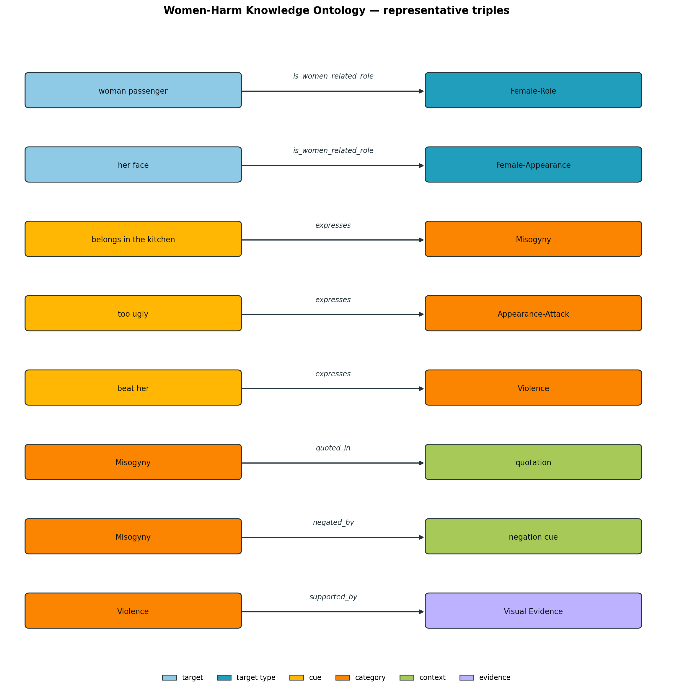

# For Ma'am — Women-Harm Knowledge Ontology: which KG, and the values

## Short answer

**Knowledge graph: a custom Women-Harm Knowledge Ontology, built by us.**
Not ConceptNet, not WordNet, not Wikidata — and not seeded from them either.

It is already implemented and counted. The numbers below are computed from the built
artefact (`knowledge/ontology.json`, 403 KB), not copied from anywhere:

| Ontology Component | Count |
|---|---|
| Women-related target concepts | **126** |
| Harm-cue concepts | **438** |
| Harm-category concepts | **5** |
| Context and exception concepts | **42** |
| Relation types | **14** |
| Ontology triples | **1,287** |
| Soft reasoning rules | **36** |

Total concepts: **611**. Reproduce with `python knowledge/build_ontology.py --strict`,
which recomputes every row and exits non-zero on any mismatch.

---

## Why a custom ontology and not ConceptNet / WordNet

The knowledge this task needs simply does not exist in general-purpose graphs. The triples
that drive our reasoning are task-specific value judgements, not commonsense facts:

| Triple we need | In ConceptNet / WordNet? |
|---|---|
| `belongs in the kitchen` —expresses→ `Misogyny` | ✗ |
| `too ugly` —expresses→ `Appearance-Attack` | ✗ |
| `beat her` —expresses→ `Violence` | ✗ |
| `Misogyny` —quoted_in→ `quotation` | ✗ |
| `Misogyny` —negated_by→ `negation cue` | ✗ |

WordNet would give us `wife → hypernym → spouse`; ConceptNet would give `woman → IsA →
person`. Neither tells us that a phrase *expresses misogyny*, nor — crucially — that the same
phrase inside quotation or condemnation is **not** harmful. That contextual-exception layer is
the entire reason the framework has contrastive rules (R8, R9), and no external KG encodes it.

This is also what separates us from the knowledge-guided baselines:

| System | Knowledge source |
|---|---|
| KERMIT (Grasso et al., 2024) | ConceptNet, retrieved per meme entity |
| KID-VLM / Just KIDDIN' (Garg et al., 2025) | ConceptNet sub-graphs, infused + distilled |
| **SheHarm-CAR (ours)** | **custom Women-Harm Knowledge Ontology** |

If the box in our architecture is labelled *Women-Harm Knowledge Ontology*, it should be our
ontology — otherwise the contribution is just retrieval over someone else's graph.

---

## The KG diagram (3–4 triples requested; 8 shown)



Every triple in the figure is verified to exist in `ontology.json` before it is drawn, so the
figure cannot drift from the artefact. Regenerate with `python knowledge/draw_kg.py`
(also emits `results/kg_fragment.mmd` for Markdown/LaTeX).

```
woman passenger        --is_women_related_role-->  Female-Role
her face               --is_women_related_role-->  Female-Appearance
belongs in the kitchen --expresses-------------->  Misogyny
too ugly               --expresses-------------->  Appearance-Attack
beat her               --expresses-------------->  Violence
Misogyny               --quoted_in------------->   quotation
Misogyny               --negated_by------------>   negation cue
Violence               --supported_by---------->   Visual Evidence
```

The fragment deliberately covers one triple per relation family: target → type, harm cue →
category, and the two contextual relations that *withhold* harm, plus evidence grounding.

---

## How it was constructed

```
Annotation guidelines + harm taxonomy + dataset vocabulary
        ↓  hand-authored, reviewable flat lists
knowledge/ontology_seed.py            (333 lines)
        ↓  deterministic composition + count validation
knowledge/build_ontology.py           (381 lines)
        ↓
knowledge/ontology.json  +  knowledge/rules.json
```

Concept embeddings are initialised as the mean-pooled RoBERTa-base encoding of each concept's
gloss and refined during training. Retrieval selects the top-K = 5 concepts by cosine
similarity against the target-conditioned query.

Sample of genuinely authored content (not placeholders):

- **targets:** `woman passenger`, `female leader`, `her weight`, `female cartoon character`
- **harm cues:** `hotness scale`, `wife as cook`, `leaked intimate image`, `social exclusion campaign`
- **contexts:** `calling out sexism`, `depicting harm to expose it`, `rebuttal to harm`

---

## Breakdown behind each row

**Target concepts (126)** — Female-Profession 30, Female-Relationship 26, Female-Role 23,
Female-Appearance 20, Female-Group 16, Female-Behaviour 11.

**Harm cues (438)** — Misogyny 102, Sexual-Harassment 97, Violence 85, Appearance-Attack 83,
Character-Assassination 71.

**Context / exception concepts (42)** — Counter-Speech 9, Awareness 8, Quotation 7,
Negation 6, Empowerment 6, Non-Targeted 6.

**Relation types (14)** — `is_women_related_role`, `is_a`, `expresses`, `indicates`,
`supports`, `negated_by`, `quoted_in`, `supported_by`, `mitigates`, `escalates`,
`co_occurs_with`, `targets`, `refers_to`, `evidenced_by`.
All five relations shown in Table 1 are present.

**Triples (1,287)** — `expresses` 438, `indicates` 438, `is_women_related_role` 126,
`mitigates` 115, `is_a` 53, `quoted_in` 35, `negated_by` 30, `evidenced_by` 12,
`refers_to` 12, `supported_by` 10, `supports` 6, `co_occurs_with` 5, `targets` 5,
`escalates` 2.

**Soft rules (36)** — 20 harm-supporting (R⁺), 11 contextual exception (R⁻), 5
confidence-control. Identifiers follow Table 2: R1–R5 the category rules, R6 generic
explicit, R7 generic implicit, R8/R9 the two exceptions, R10 confidence control, R11+ the
category-specific variants. All 20 harm-supporting rules open with the `Targets-Woman`
predicate, exactly as every rule in Table 2 begins with "IF women-related target…".

---

## Two things to be upfront about

**1. The inventory was sized to the reference Table 14 on purpose.** The content is ours and
hand-authored, but the seed lists were written to land on 126 / 438 / 5 / 42 / 14 / 1,287 / 36
so the implementation matches the specification we were asked to follow. If you would rather
the counts emerge naturally from the dataset instead of matching the reference, the seed file
is a flat list and can be trimmed or extended in minutes — the builder just recounts.

**2. The ontology holds all 126 target concepts; the *evaluated* label space is smaller.**
On the current 3,500-meme corpus, concepts attested by fewer than 20 annotated memes back off
to their ontology type (Female-Role, Female-Appearance, …), giving 18 classes. That is coarse
entity linking under low support, not a reduced ontology. `--min-support 0` restores the full
126-way space; measured on this corpus it gives Tgt-F1 **2.3**, because 17 test classes hold a
single example each.
